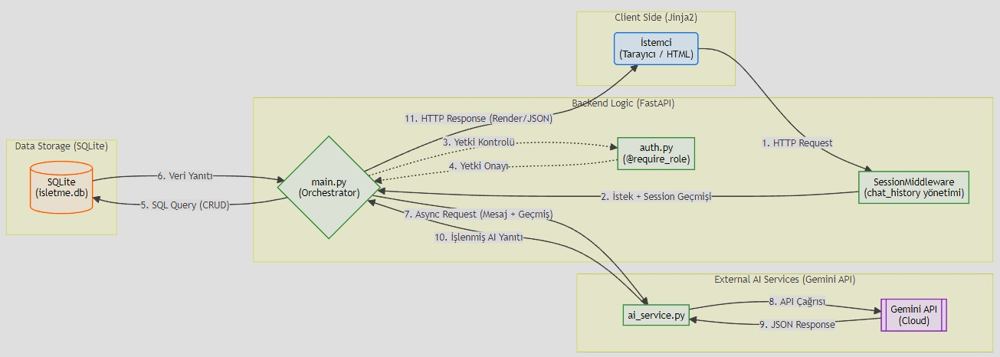

# KOBİ Asistan

## Proje Başlığı & Açıklama

**KOBİ Asistan**, yerel üreticilerin dijital dönüşümünü hızlandırmak için tasarlanmış bir e-ticaret ve market yönetim sistemidir. Bu proje, küçük işletmelerin ürün yönetimini kolaylaştırırken müşterilere modern ve güvenli bir alışveriş deneyimi sunar. Admin paneli üzerinden ürünlerin fiyatını, stok bilgisini ve görsellerini yönetebilir; müşteri tarafında ürünler görsel olarak sergilenir ve AI destekli öneri/sipariş yönetimi ile işletme süreçleri güçlendirilir.

---

## 🔑 Öne Çıkan Özellikler

- ✅ Admin paneli ile kapsamlı ürün yönetimi (CRUD işlemleri)
- 🤖 Yapay zeka destekli stok analizi ve müşteri öneri sistemi
- 🛒 Müşteri tarafında ürünlerin şık ve akıcı bir şekilde sergilenmesi
- 🔐 Rol tabanlı erişim: Admin ve müşteri panelleri ayrılmıştır
- 📦 Stok kontrolü ve sipariş durum yönetimi

---

## 🧩 Tech Stack

- Frontend: **HTML / CSS / JavaScript** (UI tasarım ve genişletilebilir ön yüz stratejisi)
- Backend: **Python + FastAPI**
- Templating: **Jinja2** ile hızlı server-side render
- Veritabanı: **SQLite**
- AI Entegrasyonu: **Google Gemini API** destekli yapay zeka servisi
- Dosya yönetimi: **FastAPI StaticFiles** ile ürün görselleri

---

## 🏛️ System Architecture

Bu proje, yönetici ve müşteri deneyimini ayrı katmanlarda sunar:

1. **Kullanıcı Arayüzü**
   - Admin paneli: Ürün, sipariş ve müşteri yönetimi
   - Müşteri paneli: Ürün listesi, sipariş takibi

2. **Backend**
   - FastAPI sunucusu HTTP isteklerini işler
   - Jinja2 ile server-side render yapılır
   - Form verileri ve dosya yüklemeleri sunucu üzerinden yönetilir

3. **Veritabanı**
   - SQLite tablosu `urunler`, `siparisler`, `musteriler`, `users`
   - Stok, fiyat, açıklama ve görsel yolu veritabanında saklanır

4. **AI Katmanı**
   - `ai_service.py` ile yerel veritabanı bağlamı oluşturulur
   - Yönetici komutları ve müşteri mesajları AI asistanına yönlendirilir

Aşağıdaki diyagram, sistemin istemci (client) isteklerini nasıl karşıladığını, veritabanı işlemlerini ve yapay zeka servisi (Gemini API) ile olan veri trafiğini özetlemektedir:



---

---

## 🤖 AI Implementation

Projede yapay zeka desteği, hem yönetici hem de müşteri etkileşimlerini güçlendirmek için kullanılır:

- **Veri odaklı bağlam oluşturma:** `ai_service.py` içindeki fonksiyonlar, ürün, müşteri ve sipariş verilerini okuyarak AI için bağlam hazırlar.
- **Doğal dil işleme:** Gemini API veya demo modu üzerinden kullanıcı mesajlarına Türkçe cevaplar üretilir.
- **Komut bazlı yönetici işlemleri:** Admin, `müşteri ekle`, `sipariş ekle`, `fiyat arttır` gibi doğal dil komutlarıyla veritabanı işlemlerini tetikleyebilir.
- **AI fallback/demosu:** API anahtarı bulunmadığında sistem, temel komutları yerel olarak işleyerek demo modu sağlar.

---

## 🚀 Kurulum & Çalıştırma

Aşağıdaki adımlarla proje yerel ortamda çalışır hale gelir:

1. Proje klasörüne gidin:

2. Sanal ortam oluşturun ve etkinleştirin:

   ```powershell
   python -m venv venv
   .\venv\Scripts\activate
   ```

3. Bağımlılıkları yükleyin:

   ```powershell
   pip install -r requirements.txt
   ```

4. Sunucuyu başlatın:

   ```powershell
   uvicorn main:app --reload
   ```

5. Tarayıcıda açın:
   - `http://127.0.0.1:8000`

---

## 🧪 Kullanım Notları

- Admin kullanıcıyla giriş yaptıktan sonra **/dashboard**, **/products**, **/orders**, **/customers** ve **/assistant** sayfalarına erişebilirsiniz.
- Ürün eklerken veya düzenlerken görsel yükleyebilir, görseller otomatik olarak `static/uploads` dizinine kaydedilir.
- Stok seviyesi `<= 5` olan ürünler kritik stok bildirimi ile gösterilir.
- AI asistanı, admin komutlarını algılayıp veritabanı üzerinde işlem yapabilir.

---

## 👥 Team

- Furkan Özüdoğru
- Yüsra Yalavuz
- Zeynep Sarı
- Sudenaz Şenbay

---

## 📌 İleriye Dönük Geliştirme Fırsatları

- 📱 **WhatsApp İşletme Otomasyonu:** Müşterilerin sipariş durumlarını anlık takip edebilmesi ve AI asistanıyla WhatsApp üzerinden etkileşime geçebilmesi için API entegrasyonu.
- ⚛️ **Modern Frontend Geçişi:** Arayüzün **React + TypeScript** kullanılarak tamamen Single Page Application (SPA) mimarisine taşınması.
- 🗄️ **Ölçeklenebilir Veritabanı:** Veri yükünü daha profesyonel yönetmek adına **PostgreSQL** veya **MySQL** geçişi.
- 🧠 **Gelişmiş AI (RAG):** AI modülünün **Retrieval-Augmented Generation** yaklaşımıyla, işletme dokümanlarından ve geçmiş verilerden daha derinlemesine analiz yapmasını sağlama.
- 💳 **Ödeme Sistemleri:** iYzico veya Stripe gibi servislerle güvenli, gerçek zamanlı ödeme altyapısının kurulması.
- 🔐 **Güvenlik Katmanı:** OAuth2 ve JWT tabanlı ileri seviye yetkilendirme sistemlerinin uygulanması.
